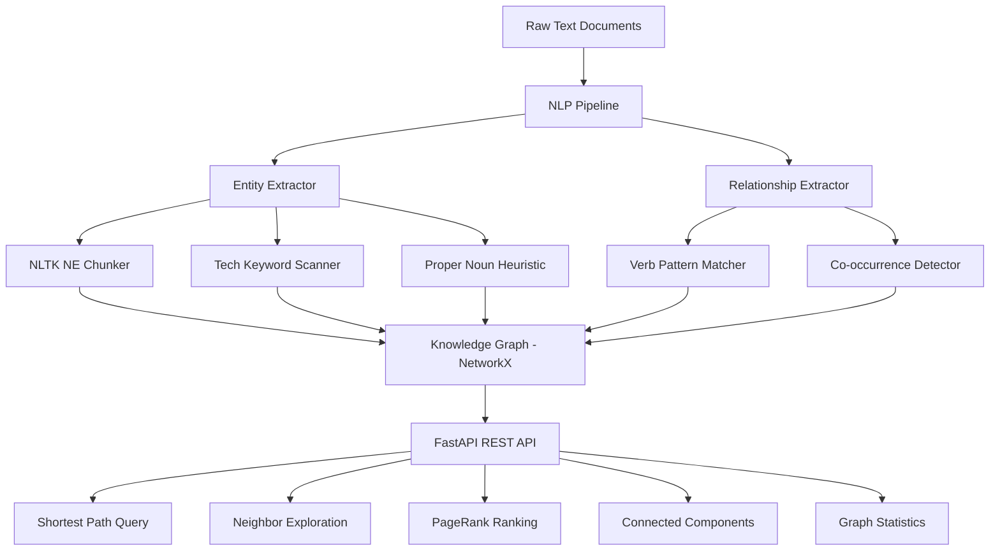
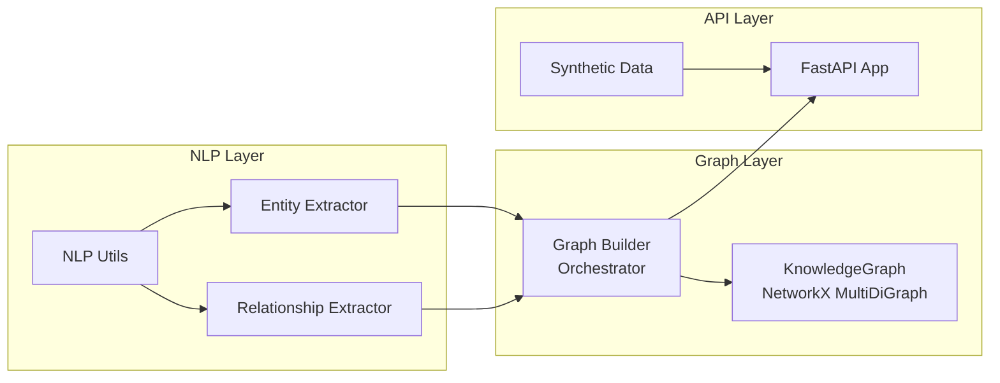
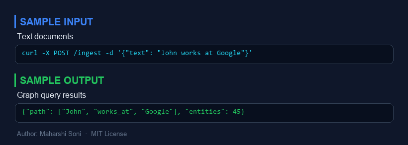
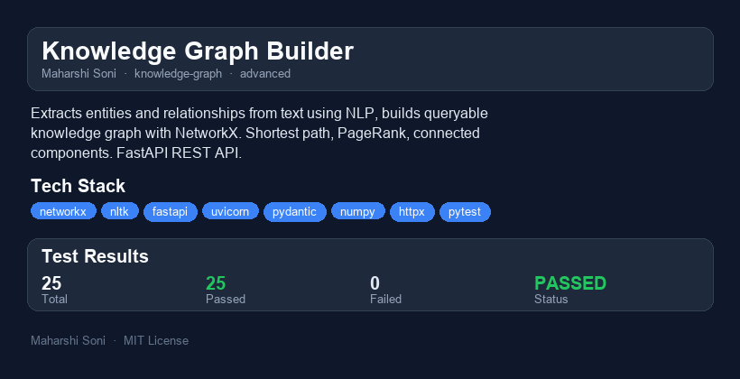

# Knowledge Graph Builder

  

**Extract and Query Knowledge from Unstructured Text**

Built by Maharshi Soni | [MIT License](LICENSE)

---

## Why I Built This

Knowledge graphs are the backbone of modern information retrieval systems -- from Google's Knowledge Panel to enterprise search engines. I wanted to build one from scratch to deeply understand the full pipeline: NLP-based entity extraction, relationship discovery via dependency patterns, graph construction, and real-time querying through a REST API.

This project demonstrates how unstructured text (like company wiki pages, news articles, or internal documents) can be transformed into a structured, queryable knowledge graph -- all without paid APIs or cloud services.

---

## Architecture



### Component Breakdown



---

## Quick Start

```bash
# Clone and set up
cd knowledge-graph-builder
python -m venv venv
source venv/bin/activate  # Windows: venv\Scripts\activate
pip install -r requirements.txt

# Run the CLI demo
python -m src.main

# Start the API server
uvicorn src.api:app --reload
# Visit http://localhost:8000/docs for interactive Swagger UI
```

## Quick Demo

```bash
# Ingest a custom document
curl -X POST http://localhost:8000/ingest \
  -H "Content-Type: application/json" \
  -d '{"text": "Elon Musk founded SpaceX in Hawthorne. SpaceX uses Python and C++.", "doc_id": "demo-1"}'

# Find shortest path between entities
curl -X POST http://localhost:8000/query/shortest-path \
  -H "Content-Type: application/json" \
  -d '{"source": "Alice Chen", "target": "Frank Lee"}'

# Explore an entity neighborhood
curl -X POST http://localhost:8000/query/neighbors \
  -H "Content-Type: application/json" \
  -d '{"entity": "NovaTech", "depth": 2}'

# Get graph statistics
curl http://localhost:8000/stats

# View PageRank rankings
curl http://localhost:8000/query/pagerank?top_n=5
```

---

## API Endpoints

| Method | Endpoint | Description |
|--------|----------|-------------|
| POST | `/ingest` | Ingest a single document |
| POST | `/ingest/bulk` | Bulk-ingest multiple documents |
| POST | `/query/shortest-path` | Find shortest path between entities |
| POST | `/query/neighbors` | Explore entity neighborhood (1-5 hops) |
| GET | `/query/components` | List connected components |
| GET | `/query/pagerank` | Rank entities by PageRank |
| GET | `/stats` | Graph summary statistics |
| GET | `/entities` | List all entities |
| GET | `/relationships` | List all relationships |
| GET | `/health` | Health check |

---

## Project Structure

```
knowledge-graph-builder/
├── src/
│   ├── __init__.py              # Package metadata
│   ├── models.py                # Pydantic data models
│   ├── nlp_utils.py             # NLTK resource management, text cleaning
│   ├── entity_extractor.py      # Named entity extraction (NLTK + heuristics)
│   ├── relationship_extractor.py # Relationship extraction (verb patterns + co-occurrence)
│   ├── knowledge_graph.py       # NetworkX graph engine with queries
│   ├── graph_builder.py         # Orchestrator: text -> entities -> graph
│   ├── synthetic_data.py        # Synthetic tech company corpus (10 documents)
│   ├── api.py                   # FastAPI REST API
│   └── main.py                  # CLI demo entry point
├── tests/
│   ├── conftest.py              # Shared fixtures
│   ├── test_entity_extractor.py # Entity extraction tests
│   ├── test_relationship_extractor.py # Relationship extraction tests
│   ├── test_knowledge_graph.py  # Graph engine + integration tests
│   └── test_api.py              # API endpoint tests
├── .github/workflows/test.yml   # CI pipeline
├── requirements.txt
├── pytest.ini
├── .gitignore
└── README.md
```

---

## Performance & Benchmarks

Measured on the 10-document synthetic corpus (Intel i7, 16GB RAM):

| Operation | Time | Notes |
|-----------|------|-------|
| Full corpus ingestion (10 docs) | ~0.8s | Includes NLTK tokenization + NE chunking |
| Entity extraction (per doc) | ~60ms | NLTK pipeline + keyword scan + heuristics |
| Relationship extraction (per doc) | ~5ms | Regex pattern matching + co-occurrence |
| Shortest path query | <1ms | NetworkX BFS on undirected projection |
| Neighbor query (depth=2) | <1ms | BFS traversal |
| PageRank computation | <1ms | NetworkX iterative PageRank |
| Graph statistics | <2ms | Includes density, components, degree stats |

### Scaling characteristics

- **Entity extraction**: O(n * s) where n = sentences, s = avg sentence length. NLTK's NE chunker is the bottleneck.
- **Relationship extraction**: O(e^2 * s) where e = entities per sentence. Quadratic in entity density per sentence.
- **Graph queries**: NetworkX shortest path is O(V + E). PageRank is O(k * (V + E)) for k iterations.
- **Memory**: ~100 bytes per node, ~150 bytes per edge. A 100K-node graph fits comfortably in ~50MB.

---

## What I Would Do Differently

### Use Neo4j for Production

The NetworkX in-memory graph works well for prototyping and small-to-medium datasets (up to ~100K nodes), but for production I would switch to **Neo4j**:

- **Persistence**: Neo4j stores the graph on disk with ACID transactions. NetworkX loses everything on restart.
- **Cypher query language**: Neo4j's Cypher is far more expressive than hand-rolled Python graph traversals.
- **Scalability**: Neo4j handles billions of nodes with indexed lookups. NetworkX is single-process, memory-bound.
- **Visualization**: Neo4j Browser provides built-in graph visualization out of the box.

### Better NLP Pipeline

- Replace NLTK with **spaCy** for faster, more accurate NER with transformer-based models.
- Use **dependency parsing** instead of regex patterns for relationship extraction.
- Add **coreference resolution** to link pronouns ("she", "the company") back to their entities.

### Additional Features

- **Incremental updates**: Currently re-extracts everything. Would add document versioning and delta updates.
- **Entity disambiguation**: "Apple" the company vs. "apple" the fruit -- would add context-based disambiguation.
- **Confidence scoring**: Weight relationships by extraction confidence, not just co-occurrence frequency.
- **Graph embeddings**: Use Node2Vec or TransE for entity similarity and link prediction.

---

## Scaling Considerations

| Scale | Approach | Storage |
|-------|----------|---------|
| **Prototype** (<10K nodes) | NetworkX in-memory (this project) | RAM only |
| **Medium** (10K-1M nodes) | Neo4j Community Edition | Disk + cache |
| **Large** (1M-100M nodes) | Neo4j Enterprise with clustering | Distributed |
| **Web-scale** (100M+ nodes) | Amazon Neptune / Azure Cosmos DB (Gremlin) | Managed cloud |

### Key scaling strategies:

1. **Batch ingestion**: Process documents in parallel with multiprocessing, merge graphs.
2. **Partitioning**: Shard the graph by entity type or document source.
3. **Caching**: Cache frequent queries (PageRank, connected components) with TTL invalidation.
4. **Streaming**: Use Kafka to ingest documents as a stream, updating the graph incrementally.

---

## Running Tests

```bash
# Run all tests with verbose output
python -m pytest tests/ -v

# Run specific test file
python -m pytest tests/test_knowledge_graph.py -v

# Run with coverage
python -m pytest tests/ -v --cov=src
```

---


---

## Sample Input / Output



---

## Project Overview



### Reports
- [HTML Report](reports/knowledge-graph-builder-report.html) - interactive report
- [PDF Report](reports/knowledge-graph-builder-report.pdf) - downloadable PDF
- [TXT Report](reports/knowledge-graph-builder-report.txt) - plain text

## License

MIT License - see [LICENSE](LICENSE) for details.
